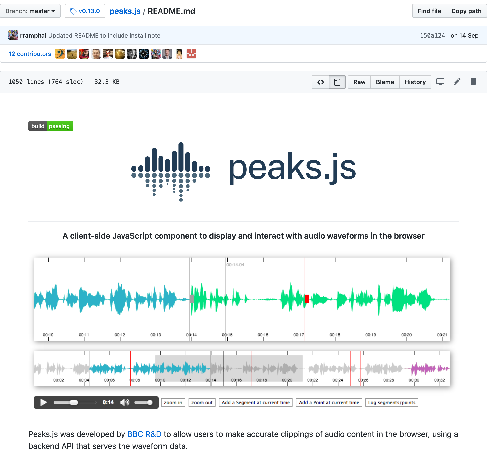
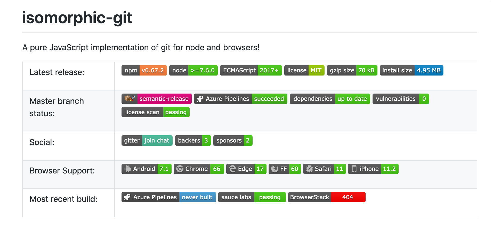
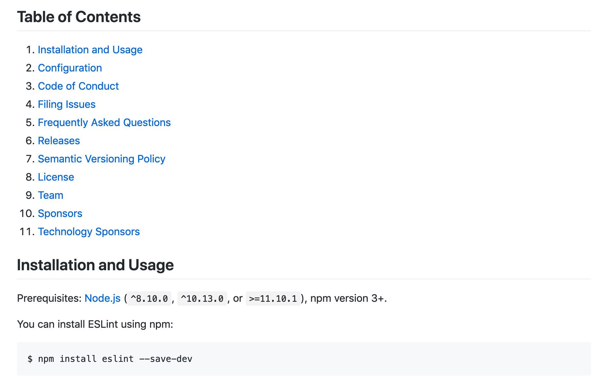
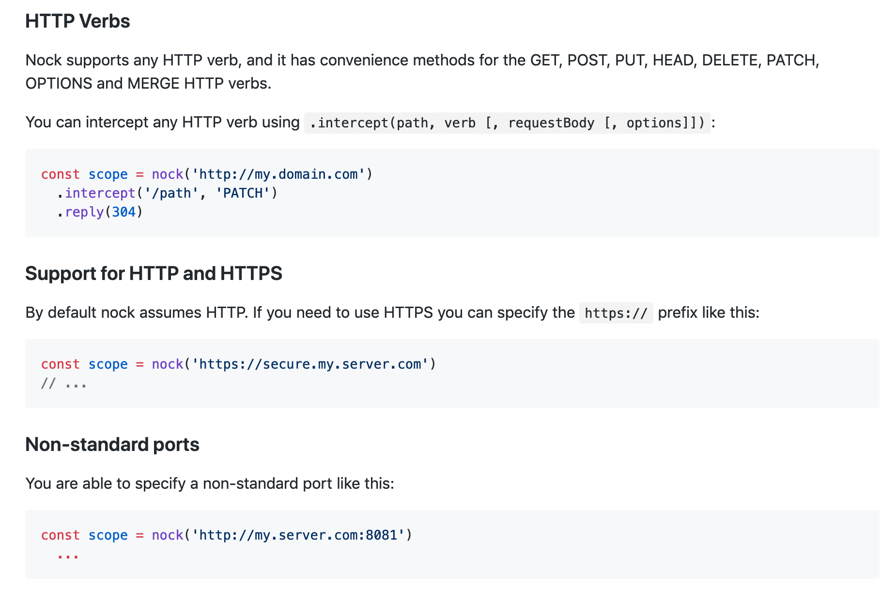
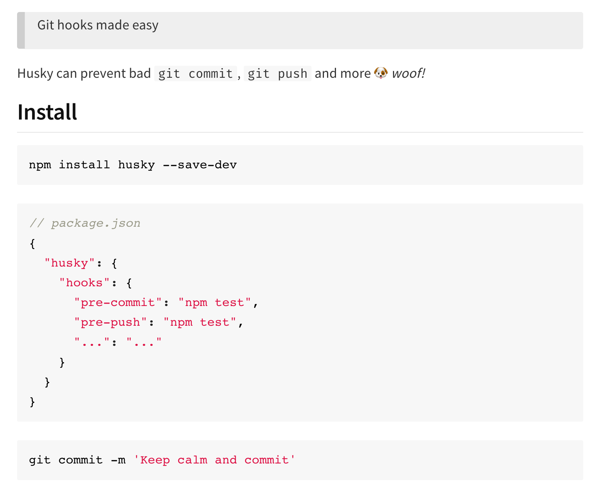
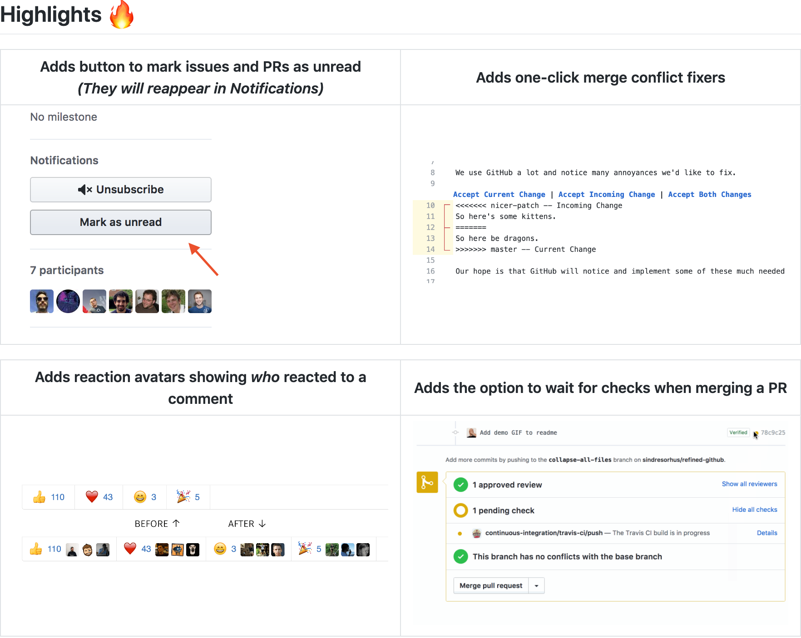

# README.md, your frugal and comprehensive go-to documentation
I read documents, software sources then write code most of my days. README files are my entry points to "feel" new software all day long before deciding if I would like to introduce them in my codebases. Without these non-eventful pieces of markup rendered as HTML, I would not be able to develop web and server applications with such ease.
All I expect is from a README is to provide me the content I need to get started and to obtain a result within a single page. I will read it more in depth as I gain more experience using this software, when I stumble on problems I cannot quite solve on my own.

When I read files like https://github.com/mozilla/fathom — “a framework for extracting meaning from web pages” — I struggle to get engaged into it. I can sense a good software but all I feel are additional barriers.
In this article, I summarized nice and essential things about README files I found over time, as well as common pitfalls that slow me down.

I wrote the article from the perspective of a full stack JavaScript developer — your experience might differ and I hope you might still be able to learn a few ways to improve the essential piece of documentation the README became.

## Table of Contents
1. [History of the README](#history-of-the-readme)
1. [General expectations of a README file](#general-expectations-of-a-README)
1. [Usual Sections and Inspirations](#usual-sections-and-inspirations)
1. [References and other resources](#references-and-other-resources)
1. [Useful Tools](#useful-tools)
1. [Credits](#credits)
1. [Contribute](#contribute)

## History of the README
Did you know the [first README text file we know of was published in 1974](http://pdp-10.trailing-edge.com/decus_20tap3_198111/01/decus/20-0079/readme.txt.html)? On November 27th 1974 to be precise. It states to be the documentation of some Fortran commands for [PDP-10 mainframes](https://en.wikipedia.org/wiki/PDP-10), back in the days a single computer would require a space comparable to an actual datacenter room.

In the early 1990, the README became a tad more interactive with the introduction of the `man` UNIX command — `man` for _system manual_. It adds a **system-wide access to software documentation** — a program is installed alongside its user manuals — and **structure**.

By structure, I mean **visual structure** — headlines, text formatting (bold, italic, underline) — as well as **content structure**, with [mandatory and optional section names](https://liw.fi/manpages/).
One could provide _different_ user manuals for a given software: for the command line interface, for library calls, for system calls and even for data formats!

Even though a `man`ual and a README file are different per se, they share common roots: improve software usability. They certainly have benefited from each other. They also have in common to be both embedded within the distributed software, requiring no additional connectivity beyond their installation.

Although I noticed something changed with the rise of GitHub and fall of SourceForge in the first decade of 2000: the README file became the first content to be displayed when browsing a repository. 2007 [first ever GitHub repo’s README](https://github.com/mojombo/grit/tree/634396b2f541a9f2d58b00be1a07f0c358b999b3#readme) is not something we can call astounding — especially from the author of the [README Driven Development blog post](https://tom.preston-werner.com/2010/08/23/readme-driven-development.html) but it is something.

Soon, the [Markdown syntax](https://daringfireball.net/projects/markdown/) popularity spread through this documentation front gate. It took it a couple of years to become a _de facto_ standard markup for README files — a popularity propagated by strongly rising programming ecosystems like JavaScript. Other platforms (gitlab.com, npmjs.com, crates.io, etc.) mimicked GitHub by displaying the content of a module/package/repository README as the main content too.
## General Expectations for a README file
So what can we expect from a README, more than 25 years after having been seen for the first time?

Writing a README is not as straightforward as it sounds, and it requires some thinking and some efforts to be legible and useful for their readers. This section is intended to brush out some expectations I have built about README files over time — [inspirations](#usual-sections-and-inspirations) will come next!



### Who is it for?
As weird as it might sound, **have you considered the audience** of this introductory piece of documentation? If you picture in your head several people you know who would stumble on the README when they get a copy of your software, are they the same kind of people? If some will fix bugs while others will use it to customize its interface or simply to use it in their daily life, they have different needs, and therefore they will read the README differently.

To make it short: a code contributor, an end user and a designer all have a different set of skills as well as different expectations when they browse (software) documentation.

The [ReLaXeD PDF generator](https://github.com/RelaxedJS/ReLaXed) is well aware of this, as it offers relevant sections for contributors — people skilled to tweak the plumbing of the software — and for users — people who would generally mostly master HTML and CSS.

I tend to proofread the README with a colleague or friend I value for their honest feedback. What they see as good are highlights to me, whereas what they do not get, bits they find confusing or mistakes they spot may be improved upon. A smooth reading requires both dedicated writing and active listening.




### Formatting
Gone are the days of README files displayed with a monospace font over 24 rows of 80 columns. Formatting options were sparse, not to say inexistant. Modern README have access to all HTML5 features — although only its most common features are part of the Markdown syntax specification.

**Headlines**, **strong emphasis** (bold), **hyperlinks**, **lists**  are four easy formatting features at our disposal to add contrast to our content — by making words more prominent and by spacing elements out.

Some **HTML5 tags can be added** with very little writing and reading overhead. Some of them have interactivity built-in, like the [`<details>` tag](https://developer.mozilla.org/en-US/docs/Web/HTML/Element/details), as seen on the [libphonenumber-js library](https://github.com/catamphetamine/libphonenumber-js):

.
**Text alignment** can be part of the deal if you concede to wrap your paragraph with a `<p>` tag and to add an extra `style` attribute. Take the following example to center a baseline text below a headline: 

```html
# Example.js

<p style="text-align: center">A JavaScript library to add more kilobytes to your front-end applications.</p>
```

### Structure
The structure of a README file conveys many cues to regular users and to new users as well. **Headlines will serve as signposting**, and will reflect how careful you are — not just with code, but with words too. A bit like a news article, general information is implicitly located at the start of a document, followed by longer bits and closed by less compulsory content — you start by answering questions, you then go in depth and you close up with gentle stuff.

**Table of contents** are great to provide a bird’s-eye view of your content. The [eslint module](https://github.com/eslint/eslint) makes good use of it to let any kind of audience start with what makes most sense to them — and they have great headlines too, the kind of content which reassures me on the maturity and ease of use of this tool:



If a README is linear by design, the human brain is not. A table of contents is one example of navigation compass. **Hyperlinks are jump springs** to navigate to previous or next parts of the same document — to other files even. Create a dedicated section and refer to it several times to clarify what your software has to offer.

**A headline depicts the content of a section** — for example, an action, a software API method or a message to the user. A question (“what is it for?”) will resonate with the reader state of mind whereas a bland label might be “invisible” in a way — “Description” is not as explicit. Complex or multi-purpose API methods can benefit of descriptive headline, as illustrated with the [nock testing module](https://github.com/nock/nock/):



By the way, **short size README are fine** too, and the [husky module](https://github.com/typicode/husky) is a good example of that. You get the gist in only a few lines, before being helped by various guides and resources (see [some more examples about these](#guides-and-resources)).



Finally, if section naming is done well enough but the target audience is ambivalent (see the [who is it for](#who-is-it-for) section), it will not prevent the reader from being confused. I struggled with the [AtJSON module](https://github.com/CondeNast/atjson): the README a good section naming — they even use questions as headlines — but they address a self-designated standard, then object shapes, then how a document is processed before ending with an example… which is the main object of this repository.

Make sure you check out the [usual sections and inspirations](#usual-sections-and-inspirations) part of this article to find out more about this topic.

### Voice & Tone
I discovered that **carefully choosing words is a thing** when I stumbled on [Kate Kiefer Lee](http://katekieferlee.com/) [Voice & Tone guide at MailChimp](https://styleguide.mailchimp.com/voice-and-tone/). Still humane whilst designed by government agencies, the [18 Fellows voice and tone](https://content-guide.18f.gov/voice-and-tone/) and [UK’s Digital Government Services writing](https://www.gov.uk/guidance/content-design/writing-for-gov-uk) guides are other examples of what words depict of you.

I cannot tell what _your_ voice should be but personally, it makes me feel good when the wording seems sincere, wholehearted and cares about not letting me down on the way. The way the [eslint README](https://github.com/eslint/eslint) and the [“How do I create a new document” section of AtJSON](https://github.com/CondeNast/atjson#how-do-i-create-a-new-document) are written make me feel real humans are behind the words and the code, and I can get in touch with them if I need help. It reassures me to know I won’t be turned down by some pedantic criticism about a missing semicolon.

Words like “easy”, “obviously”, “simple” and expressions like “everybody knows” have a high potential to make me feel dumb. The writer can hardly assess for others if something is easy, obvious or simple. Being friendly, sincere and at reach by their audience require a bit more courage than writing a couple of words.

Who do you want to be when you sit next to a user and read the README out loud? Maybe that will provide you some guidance on how you write to this person, and the rest of your user base.

### Visual cues
[Formatting content](#formatting) and [having a clear structure](#structure) can be complemented by visual elements. They convey more information on a small surface and become eye-catching when repeated — writing has its own **design patterns** after all!

When the outcome is related to a computer interface, the quickest way to get a reader to the outcome is to display a **screenshot of your software** — either a static or animated one. One or many images work, either to introduce or to highlight key aspects of a program. Have a look at [Refined GitHub](https://github.com/sindresorhus/refined-github/), to [ReLaXeD](https://github.com/RelaxedJS/ReLaXed) and to [RunJS](https://github.com/lukehaas/runjs) for example — especially for the latter, the screenshot clarified what the repository was about. Without it I would not have figured out it was a standalone desktop application.



Tables are great to regroup information and grab attention with a single word: a row with “Windows, Linux, macOS” will raise a question, confirmed by rolling an eyeball up the table header, or its headline to get the context. The [PowerShell](https://github.com/PowerShell/PowerShell) README makes a great use of tables to present a multi-entry list of download links.

When the output of a program is textual — either words or structured data — a self-explanatory and very visual way of showing things out is to display a **sample output inside a code block**. I would have benefited from this to get an idea of the shape of data objects of the [MoMa collection](https://github.com/MuseumofModernArt/collection), for example — especially when the data files are too large to be previewed in the online source tree explorer.
 
### Tips
I have assumed the README is a file located at the root of a software repository. Do you know a **README serves as an _index file_ in any directory** of your versioned tree? It is pretty handy if you feel the need to split its content out, or if you want to address specific needs for relevant folders of your projects.

You get Markdown to HTML conversion for free with the GitHub API when you use their [Repositories Contents API](https://developer.github.com/v3/repos/contents/#get-the-readme) combined with a custom `Accept` HTTP Request header. Give it a spin to get an HTML copy of this article, using cURL in a terminal:

```bash
curl --header 'Accept: application/vnd.github.VERSION.html' https://api.github.com/repos/oncletom/behind-the-code-readme-article/readme
```

Or directly in your web browser, using the Developer Tools:

```javascript
await fetch('https://api.github.com/repos/oncletom/behind-the-code-readme-article/readme', {headers: {'Accept': 'application/vnd.github.VERSION.html'}}).then(response => response.text())
```

Without the `Accept` request header, you would obtain a JSON response in which the `content` field would be the Base64 encoded raw content of the README.

Although I only mentioned the [Markdown syntax](https://daringfireball.net/projects/markdown/syntax) so far, other syntaxes might be more comfortable — or feature-complete — for what you have in mind. My favourite one is [AsciiDoc](https://asciidoctor.org/) (`.adoc` or `.asciidoc` file extension) but you can get your hands on [docutils’ ReStructuredText]((http://docutils.sourceforge.net/docs/ref/rst/restructuredtext.html)) (`.rst`), [Ruby’s RDoc](https://ruby.github.io/rdoc/) (`.rdoc`), [Textile](https://www.promptworks.com/textile) (`.textile`), and even à-la-Wikipedia [MediaWiki](https://www.mediawiki.org/wiki/Help:Formatting) (`.mediawiki`).

Find out more about how GitHub processes a README file in the [github/markup repository](https://github.com/github/markup) — wait for it — README.

## Usual Sections and Inspirations
Now we brushed out the general aspects, let’s dive into the value you can bring to your readers via some specific sections of your README.


### Description
Well, if the content part above the fold of a README is… self-descriptive, we can make an exception and not label explicitly we describe our software.

But what is a description anyway? Probably something that states in a sentence or two what the program is about (“X is a Y to do Z.”), maybe a [screenshot](#visual-cues) and some context, if applicable.

After the one liner, it is a good time to add more context — what the output is, what the inputs are, the browser compatibility, runtime requirements, etc. So, elements that **describe _what_ this is**, and what this is about. It might seem obvious to you why you developed that software, or what these data come from, but it is not the case for the people who are not the core audience of your work.

Also, if the repository is about a tool to transform something into something else, it is a good moment to refer to the syntax/specifications/user manual of that “something”. For example, [Asciidoctor](https://github.com/asciidoctor/asciidoctor/) is a Ruby tool to convert AsciiDoc syntax into various formats including HTML, but they never refer to the input syntax expected by the library — it’s a shame because it makes it harder to use, as they assume you already know about the markup syntax.

### Usage
Writing is easy, writing explicitly is more effortful — the “Usage” section is a great to clarify what you could have missed in the [description](#description). Not only it gives a **better overall picture**, but it provides ready-to-use samples of code to speed up any person who would like to get started without reading further ado.

[franc README](https://github.com/wooorm/franc#readme) is remarkable in that way: usage is shown sooner than later, it illustrates **variants of use** of function calls and it **demonstrates several user interfaces** to obtain a result from.

### Install
Most of the time, the install process should be straightforward: a single command line — if any — and that’s it! Installation instructions start when the user has a required environment up and running, and ends right before calling your software, either from the command line, a web browser or a runnable program. Some packages install process differ depending on the platform — it is a good time to remind a state of the art way of getting software ready to be used.

Node.js [sqlite3 module](https://github.com/mapbox/node-sqlite3) does a pretty extensive job of specifying alternate ways of installing the package — especially from source, to take part of the compiled sources for your very own exotic hardware. An end user might know how to use a SQLite database on Windows, but not the inner plumbing of compiling C++ code on Linux, a potential target operating system for production deploys.

The more steps you need to install one tool, the more mistakes can be made along the way, and the more likely a user will fly away if they can find an easier alternative. And that is something visible from a README standpoint: I might not even run the instructions if I find them scary.

### Contributors
Thanking is an act of kindness. Saying “thanks” can be easily overlooked so imagine _writing_ it if the document represents the last effort of a project…

The “Contributors” section is all about the people who gave something to the project and make it what it is today: eyeball time, brain juice, lines of code, managing and triaging issues, improving the code coverage, and even money! It is up to you to thank only major contributors, or also to include the “minor” ones. Surely, there is a software somewhere to build this list automatically based on the commits history.

If you are looking for [well formatted](#formatting) “Contributors” section, head over the [entropic repository](https://github.com/entropic-dev/entropic#contributors. It makes good use of pictures, tables and emojis to describe the involvement of its community.

The “Contribution” section describes **how to contribute**. Contributions are pull requests — ranging from fixing a typo to a battle tested feature —, gardening the documentation, raising an issue, asking a question, running the communications outside of the code repository, etc.

Some platforms like GitHub and GitLab handle a `CONTRIBUTING.md` file — a README tailored for explaining the contribution process. It is displayed when a person opens a pull request — bear in mind this content might be seen for the first _after_ someone has nearly finished their contribution, not _before_ they get started.

[Gnome project librsvg](https://gitlab.gnome.org/GNOME/librsvg/blob/master/CONTRIBUTING.md) holds a pretty decent example: stating the obvious of where to report things out, guidance to collect debug logs, expectations about formatting commit messages, etc.

### Guides and resources
If the README is the Alpha of a project, it _is certainly not_ the Omega — guides and resources are additional files, external pages or related media to pay attention to in order to cover a specific topic (eg: migrating from v1 to v2), to get more background (eg: a conference presentation) or even a more lengthy content (eg: a live coding article/video to start from scratch until running a software in production). If you want to document a lot without bloating a README, it is the way to go.

I particularly like how the [sharp module](https://github.com/lovell/sharp) keeps it README concise whilst providing an extensive care to ensure its tool is useable. Amongst the resources, you find hyperlinks for detailed installation steps, a Markdown-based API reference, benchmark results, as well as a changelog. In other repositories, I found links to community forums, chatrooms and StackOverflow tags to learn more about questions asked by other developers.

### API
The “[Usage](#usage)” section cannot cover in depth what a software can do: this is what the API section is about. It works well for libraries, web services and command line software. It is meant to be a sturdy presentation of all the levers and switches of the program, all the keys to unlock its potential, in a very prosaic way.

For each API member — either a class, a function or an interface — a solid expectation is to describe the intents, the inputs (mandatory and optional arguments, object shapes), the output (object shapes), and eventually an example to illustrate or clarify things.

Describing a public interface can be very very lengthy — you can count on the “[Guides and resources](#guides-and-resources)” to link to a dedicated page or website with all the comfort you would not get out of a static README. [lodash](https://github.com/lodash/lodash/) does a great job at keeping its README simple while linking to a dedicated API documentation website, with a per-version documentation, collapsible navigation, autocompletion on method names, as well as dedicated documentation on variants of the library.

### License
The README is a convenient location to signpost the license in use for a given repository. The idea is to state the license name and to link to a dedicated `LICENSE` or `LICENSE.txt` file, with the entire license content.

If you have no idea what a license is, or which license is applicable to your project, there a [few](https://choosealicense.com/) [websites](https://ufal.github.io/public-license-selector/) to find the most suitable one.

## References and other resources
There are certainly more things to write about README files, and there are other resources to check out in order to make your very own idea of what your ideal README is:

* [Another and good article ](https://github.com/noffle/art-of-readme) — also translated in brazilian, spanish and chinese;
* [A curated list of a solid dozen of inspirational README files](https://github.com/matiassingers/awesome-readme);
* [The original article that coined the idea of starting a project by its README instead of coding](https://tom.preston-werner.com/2010/08/23/readme-driven-development.html) — its related [HackerNews conversation](https://news.ycombinator.com/item?id=1627246);
* [A 2014 talk I gave at Write the Docs Europe about README Driven Development](https://www.youtube.com/watch?v=2ZhLaahzrOQ);
* [GitHub Guide for a useful README](https://help.github.com/en/articles/about-readmes);
* [README 101](https://www.makeareadme.com);
* [A template to make good README.md](https://gist.github.com/PurpleBooth/109311bb0361f32d87a2);
* StackExchange topic [Origin of “Readme”](https://softwareengineering.stackexchange.com/questions/96966/origin-of-readme).

## Useful Tools
Here is a selection of tools I use on a regular basis, or I found interesting over the period of time I wrote this article. They can help to illustrate, preview and highlight your work.

* Authoring applications: [IA Writer](https://ia.net/writer), [Tilio](https://tilio.app/), [Markdown Preview Plus for Atom IDE](https://atom.io/packages/markdown-preview-plus), [Markdown extensions for VSCode](https://code.visualstudio.com/docs/languages/markdown), [AsciiDoc previewing tools](https://asciidoctor.org/docs/editing-asciidoc-with-live-preview/);
* [Locally preview a Markdown file as if it was rendered in GitHub](https://github.com/yoshuawuyts/vmd);
* Turn a screen recording into a GIF or MP4 video: [Peek](https://github.com/phw/peek), [Kap](https://getkap.co/) (macOS only);
* [Gifski, a GIF optimizer that works](https://gif.ski/)
* [Carbon, to turn code samples into beautiful screenshots](https://carbon.now.sh/)
* [GitHub Pages](https://pages.github.com/) — a good way to both turn your repository into a fully fledged website, and to use the README as its index page;
* Generating documentation websites from lightweight markup files: [ReadTheDocs](https://readthedocs.org/), [GitBook](https://www.gitbook.com/), [Antora](https://antora.org/).

## Credits
Thank you Anne-Laure Civeyrac for helping me through the whole writing process, reviewing and being so patient with aversion of deadlines.

Thank you [Noémie](https://noemiegirard.co/), [Guillaume](https://github.com/Mogztter) and [Sofia](https://fr.linkedin.com/in/sofia-boulaarab-97468478) for reviewing the article and for your suggestions.

Thank you Samantha Thackray for proofreading the article, fixing typos and improving the phrasing of the content.

## Contribute
You have spotted a typo, you would like to fix a link or you are in a mood to suggest something else? [Browse the source repository](https://github.com/oncletom/behind-the-code-readme-article) of this article and open a pull request.

I will do my best to review your proposal in due time.
